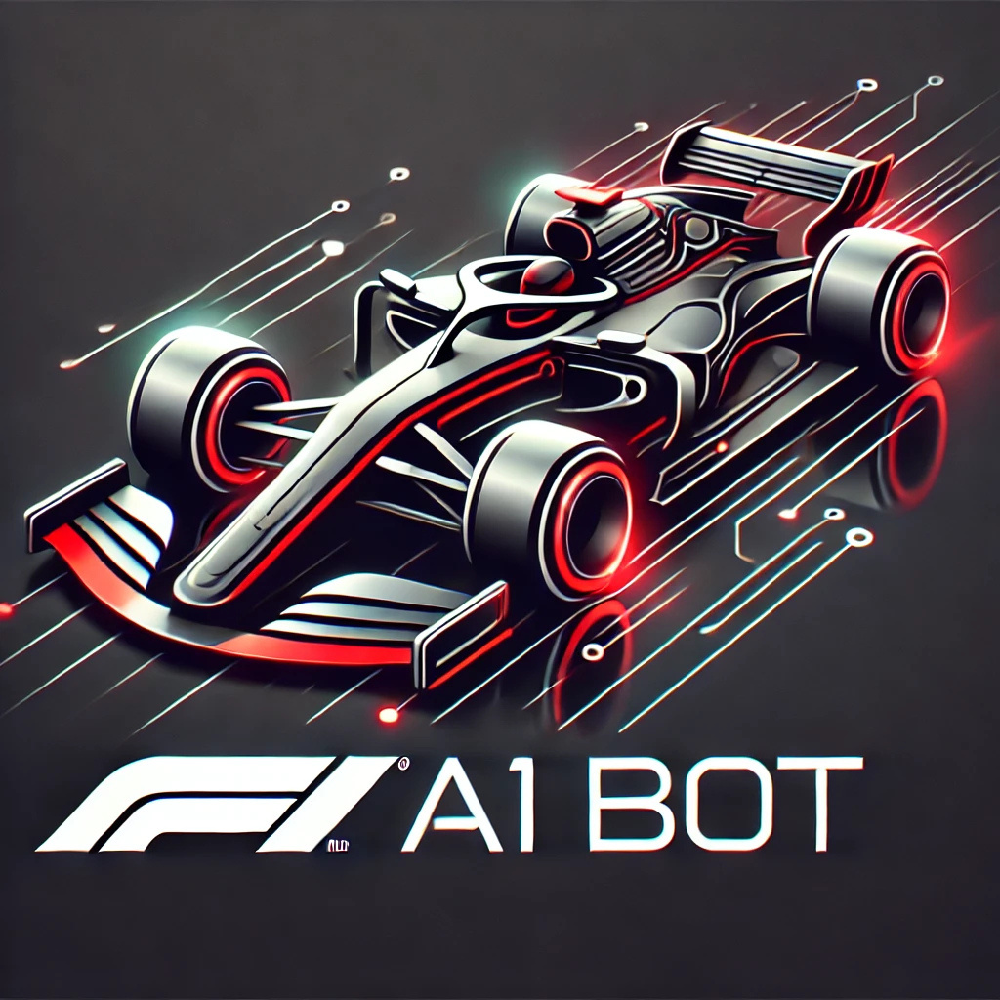

# PaddockPal - Your F1 Expert Chatbot



PaddockPal is an AI-powered Formula 1 expert chatbot built with Next.js 14.2.0 and TypeScript. It leverages Google's Gemini AI to provide accurate and engaging information about Formula 1 racing, making it the perfect companion for F1 fans seeking insights, statistics, and explanations about the sport.

## Table of Contents
- [Features](#features)
- [Tech Stack](#tech-stack)
- [Getting Started](#getting-started)
- [Project Structure](#project-structure)
- [Key Features Explained](#key-features-explained)
- [Development](#development)
- [Deployment](#deployment)
- [Performance Optimization](#performance-optimization)
- [Contributing](#contributing)
- [License](#license)
- [Acknowledgments](#acknowledgments)

## Features

- Formula 1 expertise through 2023 season
- Real-time streaming responses with typing indicators
- Interactive chat interface with markdown support
- Dark/light mode toggle with system preference detection
- Responsive design for mobile and desktop
- Message feedback system with thumbs up/down
- SEO optimized with Next.js 14.2.0 metadata API
- Mobile-friendly with iOS home screen support

## Tech Stack

- **Frontend**: Next.js 14.2.0, React 18, TypeScript 5.3
- **AI**: Google Gemini AI (via Google Generative AI API)
- **Styling**: Modern CSS with custom theming and responsive design
- **Rendering**: Markdown-it for rich text responses
- **Deployment**: Ready for Vercel deployment
- **Build Tools**: Latest Node.js module resolution

## Getting Started

### Prerequisites

- Node.js 18+ and npm
- Google Generative AI API key (Gemini model access)

### Installation

1. Clone the repository:
```bash
git clone https://github.com/Thin-Equation/paddockpal.git
cd paddockpal
```

2. Install dependencies:
```bash
npm install
```

3. Set up environment variables:
   - Create a `.env.local` file in the root directory
   - Add your Google API key: `GOOGLE_API_KEY=your_api_key_here`

4. Run the development server:
```bash
npm run dev
```

5. Open [http://localhost:3000](http://localhost:3000) in your browser.

### Testing the API

To test the Gemini AI integration manually, you can send a request to the API endpoint:

```bash
curl -X POST http://localhost:3000/api/generate \
  -H "Content-Type: application/json" \
  -d '{"model":"gemini-2.0-flash","contents":[{"role":"user","parts":[{"text":"Who won the 2023 F1 championship?"}]}]}'
```

## Project Structure

```
paddockpal/
├── public/                 # Static assets
│   ├── apple-touch-icon.png
│   ├── apple-touch-icon-precomposed.png
│   └── icon.png
├── src/
│   ├── app/                # Next.js App Router
│   │   ├── api/
│   │   │   └── generate/   # API endpoint for Gemini AI
│   │   ├── globals.css     # Global styles
│   │   ├── layout.tsx      # Root layout with metadata
│   │   └── page.tsx        # Home page component
│   ├── components/         # React components
│   │   ├── ChatUI.tsx      # Chat interface component
│   │   └── Navbar.tsx      # Navigation with theme toggle
│   └── utils/              # Utility functions
│       └── gemini-api.ts   # Stream handling for Gemini API
├── .env.local              # Environment variables (create this)
├── next.config.js          # Next.js configuration
├── package.json            # Project dependencies
└── tsconfig.json           # TypeScript configuration
```

## Key Features Explained

### Real-time Streaming Responses
The application uses server-sent events and ReadableStream API to show AI responses in real-time as they're generated, creating a more interactive chat experience similar to ChatGPT.

### Theme System
PaddockPal includes a theme system that detects user preferences from operating system settings and remembers their choice between sessions using local storage. The theme toggle animates smoothly between modes.

### Formula 1 Domain Knowledge
The AI is specifically tuned for Formula 1 knowledge with a custom prompt that helps it generate relevant and accurate information about the sport, including:
- Driver and team statistics
- Race history and records
- Technical regulations
- Circuit information
- Championship standings

## Development

### Code Style and Quality

The project uses ESLint with the Next.js configuration for code quality. Run the linter with:

```bash
npm run lint
```

### Type Checking

TypeScript is configured with strict mode enabled for better code quality and developer experience. Check types with:

```bash
npx tsc --noEmit
```

## Deployment

PaddockPal can be deployed to Vercel with minimal configuration:

```bash
npm install -g vercel
vercel
```

You can also deploy to other platforms like Netlify, AWS Amplify, or any service that supports Next.js applications.

## Performance Optimization

- All components using markdown are client-side to avoid hydration issues
- API responses are streamed for better user experience
- Next.js App Router for optimized loading
- Proper TypeScript configuration with moduleResolution set to "bundler" for optimal builds

## Contributing

Contributions are welcome! Please feel free to submit a Pull Request.

1. Fork the repository
2. Create a feature branch: `git checkout -b feature-name`
3. Commit your changes: `git commit -m 'Add some feature'`
4. Push to the branch: `git push origin feature-name`
5. Submit a pull request

## Acknowledgments

- Formula 1 for inspiring this project
- Google for providing the Gemini AI capabilities
- Next.js team for the excellent framework
- The open-source community for valuable tools and libraries
